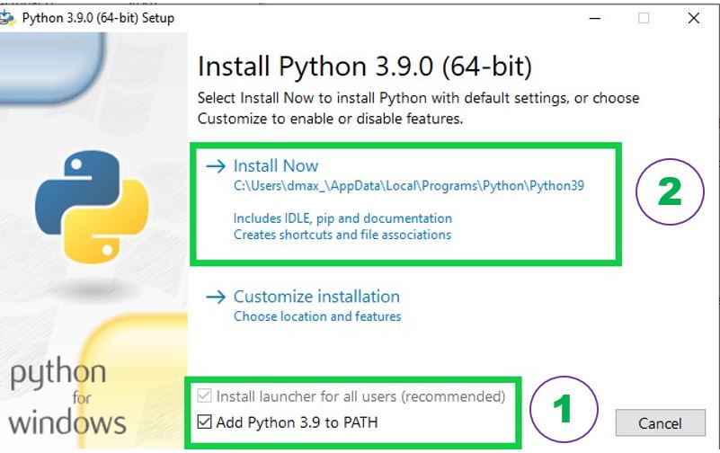
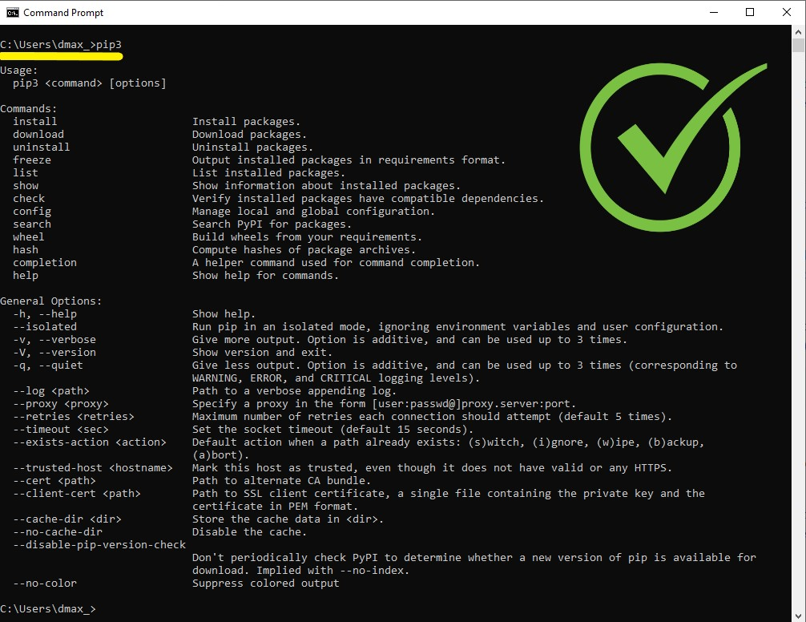
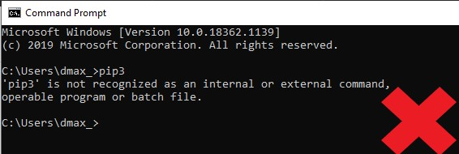
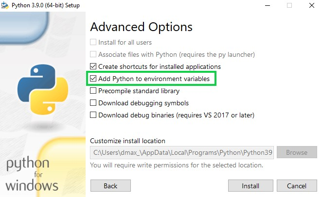
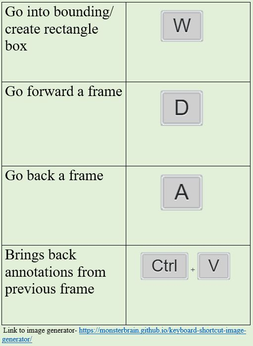

# Label Vision

LabelVision is a photo and video annotation tool used to identify people and track their movement from frame to frame. The goal is to use these annotations as an input for a machine learning algorithm to be able to annotate videos automatically. 

## Python and Pillow Installation

1. LabelVision requires Python 3.6 or greater. This can be downloaded from the [Python downloads page here](https://www.python.org/downloads/). It is recommended that you install Python 3.9.0.  

2. After downloading the correct version of Python for your system, the download file.exe should be run. A window will appear that will ask if you would like to install Python to your machine. **During this step, it is vital that you check the box that says "Add Python 3.9 to path".** Continue with the installation.  

3. Following the installation, a window should appear saying "Setup Successful". To check if Python installed correctly, open your command window ("Command Prompt" for Windows; "Terminal" for Mac) and type:  	 
	
		pip3
		
	One of two things will happen. 
	
	**One**: a list of help commands and actions will be displayed (shown below). If this is the case, you have installed python correctly and can move to step four. 
	
	
	
	**Two**: the command line will display "pip3 is not recognized as an internal or external command" as shown below. If this is the case, navigate to the Python download.
	
	
	
	If you see something similar to what is shown directly above, open the Python download .exe file and choose "Modify". Navigate to the final window (Advanced Options) with "Next" and make sure to check the option "Add Python to envrionment variables".
	
	
	
	Close your command window and repeat step 3. If this does not solve your issue, navigate to the links below for a more in depth installation of Python for the system of your choice. 

	[Windows](https://www.youtube.com/watch?v=i-MuSAwgwCU&ab_channel=IDGTECHtalk) 

	[Mac](https://www.youtube.com/watch?v=TgA4ObrowRg&ab_channel=AutomationStepbyStep-RaghavPal) 

4.   Following the installation of Python, it is required that you install the Pillow module via the command line. Again, if using a Windows machine, open the "Command Prompt" program. If using a Mac machine, open the "Terminal" program. Once you have opened it, type the following:
	
	pip3 install Pillow

## LabelVision Download and Installation

1. With Python and Pillow installed, you can now download and use LabelVision. From the Github repository, select the drop down green arrow that says "Code" and download the zipped file. Extract these files to a folder called LabelVision.

2. To launch the program, navigate to your LabelVision directory, select the file main.py, right click and choose the option to edit with IDLE (whatever version you have). Following this, use F5 or the "run module" option under the "Run" tab to launch LabelVision. 

## Test Cases 
1. Now that you should have the LabelVision application up and running, we are going to test to see if you can open a directory of photos to annotate. In the Google Drive under Greg and Rick Research Group -> COVID Project, there will be a compressed folder called Test Directory. Download and unpack this folder.

2. Within LabelVision, go to file -> Open Directory and then navigate to the test directory. Click on the folder containing the 5 frames that you downloaded from Google Drive and click open. This should bring up the first frame within the LabelVision window. 

For Greg, Rick, Meghana, Steven - This will be the end of the test. Ignore the rest of this readme file. 
---------------------------------------------------------------------------------------------

## Usage

Using LabelVision is actually quite simple and there are a minimal amount of controls.  

The first step in using the program to annotate video is selecting your directory. Go to "File" -> "Open Directory" in the top left.  

Choose the directory (most likely a photo set) that you would like to annotate. 

Once you have opened your image directory in LabelVision, the first frame in the set should appear on the screen. 

## Shortcuts and Hotkeys

(Perhaps insert the image for the hotkeys here)

W - with the W key, you can switch between creating annotations by dragging your mouse (the pointer color will be black) and deleting annotations by simply clicking on it (the pointer color will be red in this mode).

A/D - A and D are used to move to the previous frame and next frame in the photo set, respectively. 
